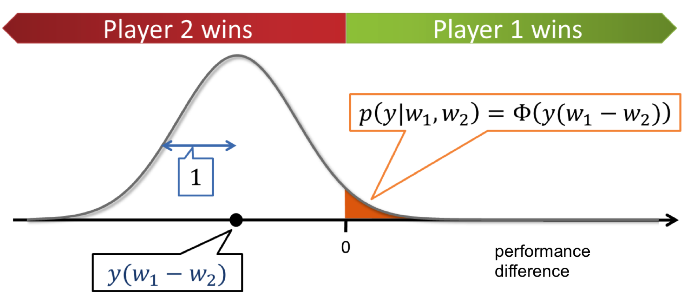
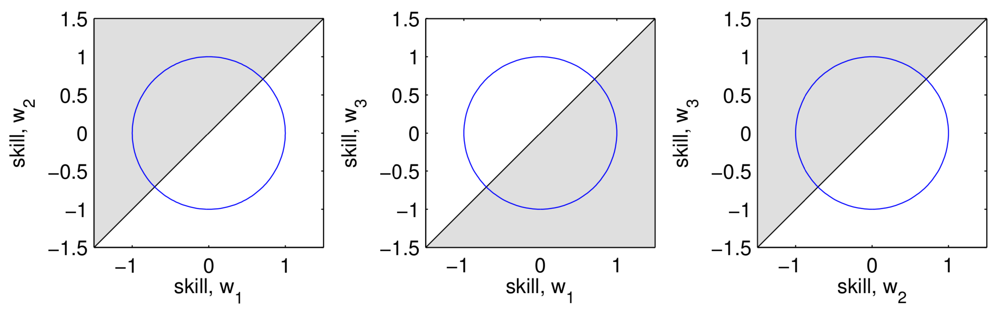
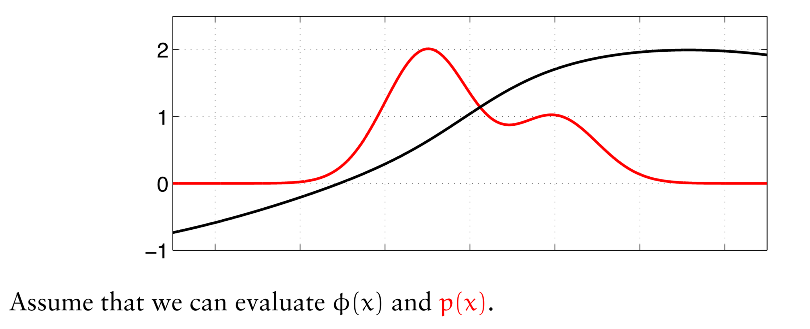

# Index
- [15-Introduction-to-Probabilistic-Ranking](#15-Introduction-to-Probabilistic-Ranking)
- [16-Gibbs-Sampling-for-Inference](#16-Gibbs-Sampling-for-Inference)
- [17-Gibbs-Sampling-in-TrueSkill](#17-Gibbs-Sampling-in-TrueSkill)

---

## 15-Introduction-to-Probabilistic-Ranking
[index](#index)
### Motivation

***Competition*** is a fundamental aspect of human nature and society. It drives progress and excellence in various fields, especially in sports. In contemporary times, ranking systems are prevalent in virtually every sport.

#### The Fundamental Question: 
Despite the widespread use of ranking systems, they often fail to answer a crucial question effectively:

What is the probability that Player 1 defeats Player 2?

Understanding this probability is vital for:
- **Predicting Match Outcomes**: For fans, coaches, and betting markets.
- **Assessing Player Skill**: Beyond just win-loss records.
- **Making Rational Decisions**: In betting or strategic planning.

A robust ranking system should provide insights into these probabilities, reflecting the true skill levels of the players involved.

### The ATP Ranking System: An Example

#### How the ATP Ranking System Works
1. **Best 18 Results**: A player's ranking is determined by the sum of their best 18 tournament results over the past 52 weeks.
2. **Mandatory Events**:
   - 4 Grand Slams: Australian Open, French Open, Wimbledon, US Open.
   - 8 Masters 1000 Series Events: High-profile tournaments with significant points.
3. **Additional Tournaments**: The best 6 results from other tournaments, including ATP 500 and ATP 250 events.

### Limitations 
While the ATP ranking system provides a structured method for ranking players, it has several drawbacks:

1. **Ignores Opponent Strength**: The system does not consider the quality of opponents defeated. Beating a top-ranked player yields the same points as beating a lower-ranked player in the same tournament round.
2. **Inconsistent Tournament Participation**: Players may choose different tournaments beyond the mandatory ones, leading to rankings based on non-overlapping events.
3. **Arbitrary Point Assignments**: The point values assigned to different tournament stages and categories are somewhat arbitrary and may not accurately reflect the skill difference between players.
4. **Temporal Relevance**: Results from up to 52 weeks ago may not represent a player's current form or skill level.

---

### Towards a Probabilistic Ranking System

#### Defining Player Skill
To address these limitations, we propose a probabilistic ranking system that focuses on inferring each ***player's skill level***, denoted by $w_i$, where $i$ represents a player.

Key Properties of the Skill Model:
- **Comparability**: Skills are on a common scale; a higher skill implies a higher chance of winning.
- **Uncertainty**: Recognizes the uncertainty in estimating a player's true skill due to limited data.
- **Predictive Capability**: Enables computation of the probability of one player defeating another.

### A Generative Model for Match Outcomes
We model the outcome of a match between two players using a simple probabilistic framework:

1. **Skill Levels**: Each player $i$ has a latent skill $w_i$, assumed to be a real-valued scalar.
2. **Skill Difference**:
   $$s = w_1 - w_2$$
   Represents the expected performance difference between Player 1 and Player 2.
3. **Performance Noise**:
   $$n \sim N(0, \sigma^2)$$
   Accounts for variability in performance due to factors like form, luck, and external conditions.
4. **Observed Performance Difference**:
   $$t = s + n = w_1 - w_2 + n$$
   This is a random variable due to the noise term.
5. **Game Outcome**:
   $$y = \text{sign}(t)$$
   - $y = +1$ if Player 1 wins.
   - $y = -1$ if Player 2 wins.

By incorporating noise, we acknowledge that even a less skilled player can occasionally win due to chance.

### Probability of Winning
The probability that Player 1 defeats Player 2 is:
$$p(y = +1 \mid w_1, w_2) = p(t > 0 \mid w_1, w_2)$$
Since $t$ is normally distributed, we have:
$$t \sim N(w_1 - w_2, \sigma^2)$$
Therefore:
$$p(y = +1 \mid w_1, w_2) = \Phi\left(\frac{w_1 - w_2}{\sigma}\right)$$
where $\Phi(\cdot)$ is the cumulative distribution function (CDF) of the standard normal distribution.

**Interpretation**:
- A larger difference in skill levels increases the probability that the higher-skilled player wins.
- The noise parameter $\sigma$ controls how much variability there is in match outcomes due to factors other than skill.

### The Likelihood Function in Detail

#### Deriving the Likelihood
The likelihood of observing a game outcome $y$ given the players' skills $w_1$ and $w_2$ is:

$$p(y \mid w_1, w_2) = \int_{-\infty}^\infty p(y \mid t) \cdot p(t \mid w_1, w_2) \, dt$$

Since $y = \text{sign}(t)$, $p(y \mid t)$ is deterministic:

$$p(y \mid t) = \delta(y - \text{sign}(t))$$

where $\delta(\cdot)$ is the Dirac delta function.

Therefore, the likelihood becomes:

$$p(y \mid w_1, w_2) = \int_{-\infty}^{\infty} \delta(y - \text{sign}(t)) \cdot N(t \mid w_1 - w_2, \sigma^2) \, dt$$

This integral simplifies to:

$$p(y \mid w_1, w_2) = \int_{t : y \cdot t > 0} N(t \mid w_1 - w_2, \sigma^2) \, dt = \Phi\left(\frac{y (w_1 - w_2)}{\sigma}\right)$$
where we have the little compactifying trick for binary variables $y = ±1$: 

$$p(y = 1 \mid z) = \Phi(z) \implies p(y = -1 \mid z) = 1 - \Phi(z) = \Phi(-z) \implies p(y \mid z) = \Phi(yz).$$

Plot for $\sigma = 1$: 

---
## TrueSkill™: A Bayesian Skill Rating System

### Introduction to TrueSkill™
TrueSkill™ is a Bayesian rating system developed by Microsoft Research for Xbox Live. It extends the Elo rating system to accommodate multiplayer games and provides a probabilistic framework for updating player skills.

### Model Components

1. **Player Skills ($w_i$):**
   - Treated as random variables with prior distributions:
     $$p(w_i) = N(w_i \mid \mu_i, \sigma_i^2)$$
   - Reflects our uncertainty about each player's true skill.

2. **Performance Differences ($t_g$):**
   - For each game $g$, the performance difference is:
     $$t_g = w_{I_g} - w_{J_g} + n_g$$
     where $n_g \sim N(0, \sigma_n^2)$.

3. **Game Outcomes ($y_g$):**
   - Observed as:
     $$y_g = \text{sign}(t_g)$$

4. **Likelihood of Outcomes:**
   - The probability of the observed outcome given the skills is:
     $$p(y_g \mid w_{I_g}, w_{J_g}) = \Phi\left(\frac{y_g (w_{I_g} - w_{J_g})}{\sigma_n}\right)$$

### Bayesian Inference in TrueSkill™

The goal is to update our beliefs about the players' skills after observing game outcomes. Using Bayes' theorem:

$$p(w \mid y) \propto p(w) \prod_g p(y_g \mid w_{I_g}, w_{J_g})$$

where:
- $w$ is the vector of all players' skills.
- $y$ is the vector of all game outcomes.

**Challenges**:
- The posterior distribution $p(w \mid y)$ does not have a closed-form solution due to the non-conjugate likelihood function involving $\Phi(\cdot)$.
- The skills become correlated, making the joint distribution complex.

#### Visualization: 

To visualize this, suppose three players with skills $w_1, w_2, w_3$. The posterior between two of them, given a match outcome, is given by: 
$$ p(w_1, w_2 \mid y) = \frac{\mathcal{N}(w_1; \mu_1, \sigma_1^2) \mathcal{N}(w_2; \mu_2, \sigma_2^2) \Phi(y(w_1 - w_2))}{\iint \mathcal{N}(w_1; \mu_1, \sigma_1^2) \mathcal{N}(w_2; \mu_2, \sigma_2^2) \Phi(y(w_1 - w_2)) dw_1 dw_2}. $$

- The numerator consists of: - Gaussian priors $\mathcal{N}(w_1; \mu_1, \sigma_1^2)$ and $\mathcal{N}(w_2; \mu_2, \sigma_2^2)$. 
- The likelihood $\Phi(y(w_1 - w_2))$, representing the probability of the observed outcome given the skill difference. 

**Properties of the Posterior:** 
- **Correlation:** Skills $w_1$ and $w_2$ become correlated after observing $y$, even if they were independent initially. 
- **Non-Gaussian:** The posterior is no longer Gaussian due to the product with $\Phi(y(w_1 - w_2))$, which introduces a nonlinear term.

**Normalizing Constant:** - The denominator, $p(y)$, is the marginal probability of the outcome: $$ p(y) = \iint \mathcal{N}(w_1; \mu_1, \sigma_1^2) \mathcal{N}(w_2; \mu_2, \sigma_2^2) \Phi(y(w_1 - w_2)) dw_1 dw_2. $$ - This has a closed-form solution: $$ p(y) = \Phi\left(\frac{y(\mu_1 - \mu_2)}{\sqrt{\sigma_1^2 + \sigma_2^2}}\right), $$ which is a smoother version of the likelihood $p(y \mid w_1, w_2)$.

**Intuition Behind $p(y)$:** - The smoothing effect arises because $p(y)$ integrates over all possible skill values, averaging the likelihood over the uncertainty in $w_1$ and $w_2$.

Each player playes against multiple opponents, possibly multiple times; ***what does the joint posterior look like?***

**Visualizing this**:

- **3D Joint Posterior Space:** The posterior $p(w1​,w2​,w3​)$ defines a probability density over a 3D space where:
    
    - Each axis corresponds to one player’s skill $(w1, w2​, w3)$.
    - Every point in this space represents a specific combination of skills for the three players.
    - The **probability density** at each point indicates how likely that skill combination is given the observed outcomes.
- **Heatmap in 3D:** A heatmap in this context would color-code regions of the 3D space based on the probability density:
    
    - High probability density (e.g., bright red): Likely skill combinations.
    - Low probability density (e.g., dark blue): Unlikely skill combinations.

--- 

## 16-Gibbs-Sampling-for-Inference

In statistical inference and probabilistic modeling, a central challenge is the computation of expectations and integrals with respect to complex, often intractable probability distributions. Traditional analytical methods become impractical in high-dimensional spaces or when dealing with complicated distributions. 

### The Challenge of Intractable Integrals
#### Computing Expectations
We often need to compute the expected value of a function $ϕ(x)$ with respect to a probability distribution $p(x)$:

$$E_{p(x)}[ϕ(x)] = \bar{ϕ} = \int ϕ(x)p(x) \, dx$$

where $x \in \mathbb{R}^D$ and $D$ is large. When $p(x)$ is complex or high-dimensional, this integral cannot be computed analytically.

#### Assumptions
1. **Evaluability:** We can evaluate $ϕ(x)$ and $p(x)$ at any point $x$.
2. **High Dimensionality:** The dimensionality $D$ is large, making traditional integration methods impractical.

### Numerical Integration on a Grid
#### Grid-Based Approximation
One straightforward approach to approximate the integral is using numerical integration over a grid:

$$\int ϕ(x)p(x) \, dx \approx \sum_{\tau=1}^T ϕ(x^{(\tau)})p(x^{(\tau)}) \Delta x$$

where:
- $x^{(\tau)}$ are points on a grid in $\mathbb{R}^D$.
- $\Delta x$ is the volume element (the "size" of each grid cell).
- $T = k^D$ is the total number of grid points, with $k$ points per dimension.

#### Limitations
1. **Curse of Dimensionality:** The number of grid points grows exponentially with $D$. 
2. **Computational Feasibility:** This method is only practical for very low-dimensional problems ($D \leq 4$).
3. **Inefficiency:** Even in moderate dimensions, the computational cost becomes prohibitive due to the exponential growth in $T$.

### Monte Carlo Integration
#### Fundamental Principle
Monte Carlo integration approximates the expectation by averaging over random samples drawn from $p(x)$:

$$E_{p(x)}[ϕ(x)] \approx \hat{ϕ} = \frac{1}{T} \sum_{\tau=1}^T ϕ(x^{(\tau)}), \text{ where } x^{(\tau)} \sim p(x)$$

#### Advantages
1. **Dimension Independence:** The convergence rate of the estimator $\hat{ϕ}$ is independent of $D$. The variance $V[\hat{ϕ}] = V[ϕ]/T$, where $V[ϕ]$ is the variance of $ϕ(x)$ under $p(x)$.
2. **Law of Large Numbers:** As $T \to \infty$, $\hat{ϕ}$ converges to $\bar{ϕ}$ almost surely.
3. **Unbiased Estimator:** The estimator $\hat{ϕ}$ is unbiased, meaning $E[\hat{ϕ}] = \bar{ϕ}$.

#### Challenges
1. **Sampling Difficulty:** Drawing independent samples from $p(x)$ can be difficult if $p(x)$ is complex or not standard.
2. **Computational Cost:** While dimensionally efficient, the method requires a large number of samples for accurate estimation if $V[ϕ]$ is large.
3. **Variance Reduction:** Techniques may be needed to reduce variance and improve convergence rates.

### Markov Chain Monte Carlo (MCMC)

MCMC methods construct a Markov chain whose stationary distribution is $p(x)$. By simulating the chain, we can obtain samples approximately distributed according to $p(x)$, even when direct sampling is infeasible.

#### Markov Chains
- **Definition:** A sequence $x^{(0)}, x^{(1)}, x^{(2)}, \dots$ where $x^{(t+1)}$ depends only on $x^{(t)}$.
- **Transition Kernel:** The probability $q(x' \mid x)$ of transitioning from $x$ to $x'$.
- **Stationarity:** A distribution $\pi(x)$ is stationary if:

  $$\int q(x' \mid x) \pi(x) \, dx = \pi(x')$$

### MCMC Procedure
1. **Design $q(x' \mid x)$:** Choose a transition kernel that satisfies detailed balance with respect to $p(x)$.
2. **Simulate the Chain:** Generate samples $x^{(0)}, x^{(1)}, \dots$ using $q(x' \mid x)$.
3. **Convergence:** Under suitable conditions, the distribution of $x^{(t)}$ converges to $p(x)$ as $t \to \infty$.

#### Benefits
1. **Generality:** Applicable to a wide range of distributions.
2. **Flexibility:** Can handle distributions known only up to a normalizing constant.

### Gibbs Sampling

Gibbs sampling is an MCMC method that simplifies sampling from a joint distribution by sequentially sampling each variable from its conditional distribution, given the current values of the other variables.

#### The Gibbs Sampler Algorithm
1. **Initialization:** Start with an arbitrary initial state:
   
   $$x^{(0)} = (x_1^{(0)}, x_2^{(0)}, \dots, x_D^{(0)})$$

2. **Iterative Sampling:**
   - For each iteration $t = 1, 2, \dots$:
     - For each variable $i = 1, 2, \dots, D$:
       - Sample $x_i^{(t)}$ from the conditional distribution:

         $$p(x_i \mid x_1^{(t)}, \dots, x_{i-1}^{(t)}, x_{i+1}^{(t-1)}, \dots, x_D^{(t-1)})$$

     - Update the current state: $x_i^{(t)}$ replaces $x_i^{(t-1)}$ in $x^{(t)}$.

3. **Iteration:** Repeat step 2 for a large number of iterations.

#### Why Gibbs Sampling Works
1. **Detailed Balance:** Gibbs sampling satisfies detailed balance, ensuring that $p(x)$ is the stationary distribution of the Markov chain.
2. **Ergodicity:** Under mild conditions, the Markov chain is ergodic, meaning it eventually explores the entire state space according to $p(x)$.
3. **Simplicity:** It reduces the complex task of sampling from a high-dimensional joint distribution to sampling from easier univariate conditional distributions.

#### Practical Considerations
1. **Order of Updates:** Variables can be updated in a fixed sequence or randomly selected at each iteration.
2. **Conditional Distributions:** The method requires that the conditional distributions $p(x_i \mid x_{-i})$ are known and easy to sample from, where $x_{-i}$ denotes all variables except $x_i$.

### Example: Gibbs Sampling in a Multivariate Gaussian
#### The Multivariate Gaussian Distribution
Consider a bivariate Gaussian distribution with variables $x_1$ and $x_2$, jointly distributed as:

$$(x_1, x_2) \sim \mathcal{N}\left(\begin{pmatrix} \mu_1 \\ \mu_2 \end{pmatrix}, \begin{pmatrix} \sigma_1^2 & \rho \sigma_1 \sigma_2 \\ \rho \sigma_1 \sigma_2 & \sigma_2^2 \end{pmatrix}\right)$$

where $\rho$ is the correlation coefficient.

#### Conditional Distributions
The conditional distributions of $x_1$ given $x_2$, and vice versa, are Gaussian:

1. $x_1 \mid x_2$:
   $$x_1 \mid x_2 \sim \mathcal{N}\left(\mu_1 + \rho \frac{\sigma_1}{\sigma_2}(x_2 - \mu_2), (1 - \rho^2)\sigma_1^2\right)$$

2. $x_2 \mid x_1$:
   $$x_2 \mid x_1 \sim \mathcal{N}\left(\mu_2 + \rho \frac{\sigma_2}{\sigma_1}(x_1 - \mu_1), (1 - \rho^2)\sigma_2^2\right)$$

#### Gibbs Sampling Procedure
1. **Initialize:** Choose starting values $x_1^{(0)}$ and $x_2^{(0)}$.
2. **Iterate:**
   - For each iteration $t$:
     - Sample $x_1^{(t)}$ from $p(x_1 \mid x_2^{(t-1)})$.
     - Sample $x_2^{(t)}$ from $p(x_2 \mid x_1^{(t)})$.
3. **Collect Samples:** The sequence $\{(x_1^{(t)}, x_2^{(t)})\}$ approximates samples from the joint distribution.

#### Observations
1. **Effect of Correlation:** High correlation ($\rho$ close to $\pm 1$) leads to slow mixing because changes in one variable strongly affect the other.
2. **Convergence:** Despite potential slow mixing, the chain will converge to the target distribution given enough iterations.
3. **Visualization:** Plotting the sampled points can illustrate the sampling path and convergence behavior.

### Practical Considerations in Gibbs Sampling
#### Burn-in Period
1. **Definition:** The initial set of samples that may not represent the stationary distribution due to the influence of the starting values.
2. **Purpose:** Discarding burn-in samples helps ensure that subsequent samples are more representative of $p(x)$.
3. **Determining Length:** The length of the burn-in period is problem-dependent and can be assessed using convergence diagnostics.

#### Thinning
1. **Definition:** Keeping every $k$-th sample and discarding the rest to reduce autocorrelation.
2. **Trade-off:** Thinning reduces the number of available samples, potentially increasing the variance of estimates.
3. **When to Thin:** Thinning is beneficial when autocorrelation between successive samples is high.

#### Challenges
1. **High Autocorrelation:** Leads to a lower effective sample size, requiring more iterations to achieve the desired accuracy.
2. **Complex Conditional Distributions:** May be difficult to sample from, necessitating approximation methods or alternative sampling techniques.
3. **Assessing Convergence:** No definitive test; convergence assessment often relies on multiple diagnostics and practitioner judgment.

### Advantages and Limitations of Gibbs Sampling
#### Advantages
1. **Simplicity:** Easy to implement when conditional distributions are known and easy to sample from.
2. **No Tuning Parameters:** Unlike other MCMC methods, Gibbs sampling does not require proposal distributions or tuning parameters.
3. **Applicability:** Useful in a variety of models, especially hierarchical Bayesian models and graphical models.

#### Limitations
1. **Slow Mixing:** Can mix slowly in the presence of strong dependencies between variables.
2. **Convergence Issues:** Difficult to assess convergence definitively, particularly in high-dimensional spaces.
3. **Requirement of Conditional Distributions:** Necessitates that conditional distributions are available and tractable.

--- 

## 17-Gibbs-Sampling-in-TrueSkill

### Why Gibbs Sampling?
When the posterior distribution is intractable, as in TrueSkill™, we can use Markov Chain Monte Carlo (MCMC) methods to approximate it. Gibbs sampling is a specific MCMC technique suitable when we can sample from the conditional distributions of each variable given all others.

### Gibbs Sampling Algorithm

#### Goal
Generate samples from the joint posterior $p(w, t \mid y)$.

#### Steps
1. **Initialize**:
   Set initial values for the skills $w$ and performance differences $t$.

2. **Sample Performance Differences ($t$)**:
   For each game $g$, sample $t_g$ from its conditional distribution:
   $$p(t_g \mid w_{I_g}, w_{J_g}, y_g) \propto \delta(y_g - \text{sign}(t_g)) \cdot N(t_g \mid w_{I_g} - w_{J_g}, \sigma_n^2)$$
   Since $t_g$ must be consistent with $y_g$, we sample from a truncated normal distribution.

3. **Sample Skills ($w$)**:
   Given the current $t$, sample $w$ from:
   $$p(w \mid t) = N(w \mid \mu_w, \Sigma_w)$$
   This is feasible because both the prior $p(w)$ and the likelihood $p(t \mid w)$ are Gaussian, resulting in a Gaussian posterior.

4. **Iterate**:
   Repeat steps 2 and 3 until convergence.

### Detailed Derivation of Conditional Distributions

#### Sampling $t_g$ Given $w$
The conditional distribution:

$$t_g \mid w_{I_g}, w_{J_g}, y_g \sim N(w_{I_g} - w_{J_g}, \sigma_n^2)$$

truncated to:
- $(0, \infty)$ if $y_g = +1$
- $(-\infty, 0)$ if $y_g = -1$

#### Sampling $w$ Given $t$
The conditional distribution:

$$p(w \mid t) = N(w \mid \mu_w, \Sigma_w)$$

**Calculating $\mu_w$ and $\Sigma_w$**:
Combine the prior and likelihood terms:
$$\Sigma_w^{-1} = \Sigma_0^{-1} + \sum_g \Sigma_{t_g}^{-1}$$
$$\mu_w = \Sigma_w \left( \Sigma_0^{-1} \mu_0 + \sum_g \Sigma_{t_g}^{-1} \mu_{t_g} \right)$$

### Making Predictions with TrueSkill™

After obtaining samples from the posterior distribution of skills, we can estimate the probability that one player will defeat another.

#### Probability of Player $i$ Defeating Player $j$

Expectation over Posterior:
$$p(y_{ij} = +1) = \mathbb{E}_{w_i, w_j} \left[\Phi\left(\frac{w_i - w_j}{\sigma_n}\right)\right]$$

Approximation with Samples:
$$p(y_{ij} = +1) \approx \frac{1}{N} \sum_{s=1}^N \Phi\left(\frac{w_i^{(s)} - w_j^{(s)}}{\sigma_n}\right)$$

where $w_i^{(s)}$ and $w_j^{(s)}$ are samples from the posterior.

