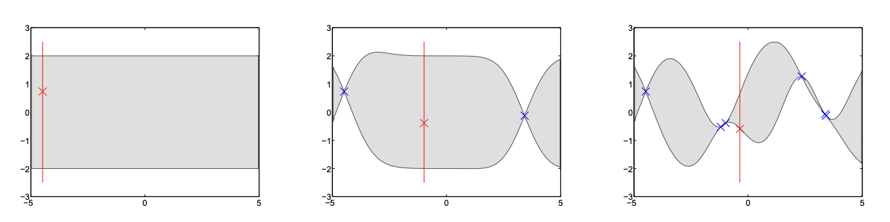

# Index

- [Gaussian Processes](#9-gaussian-processes)

## 9-Gaussian-Processes

### From Scalar Gaussians to Multivariate Gaussians to Gaussian Processes

1. **Scalar Gaussian**: A single random variable $x$ with distribution $N(\mu, \sigma^2)$.

2. **Multivariate Gaussian**: A vector $x = [x_1, x_2, \dots, x_N]^T$ with joint Gaussian distribution:

   $$
   p(x \mid \mu, \Sigma) = \frac{1}{(2 \pi)^{N/2} |\Sigma|^{1/2}} \exp \left( -\frac{1}{2} (x - \mu)^T \Sigma^{-1} (x - \mu) \right)
   $$

3. **Gaussian Process (GP)**: An extension to infinitely many variables.

   - **Definition**: A collection of random variables, any finite number of which have a joint Gaussian distribution.
   - **Intuition**: Think of functions as infinitely long vectors.

### Gaussian Process Definition
A GP is fully specified by:

- **Mean function** $m(x) = E[f(x)]$
- **Covariance function** $k(x, x') = E[(f(x) - m(x))(f(x') - m(x'))]$

**Notation**:

$$
f(x) \sim GP(m(x), k(x, x'))
$$

### Marginal and Conditional Gaussians
Key properties:

- **Marginalization**: The marginal distribution over any subset of variables is Gaussian.
- **Conditioning**: The conditional distribution given some variables is also Gaussian.

The marginalization property simplifies Gaussian processes (GPs) by leveraging their unique characteristics. The marginalization property allows you to work with finite-dimensional slices of the GP. Specifically: $$ p(\mathbf{x}) = \int p(\mathbf{x}, \mathbf{y}) \, d\mathbf{y}. $$ For a multivariate Gaussian: $$ \begin{bmatrix} \mathbf{x} \\ \mathbf{y} \end{bmatrix} \sim \mathcal{N}\left( \begin{bmatrix} \mathbf{a} \\ \mathbf{b} \end{bmatrix}, \begin{bmatrix} A & B^\top \\ B & C \end{bmatrix} \right) \quad \Rightarrow \quad p(\mathbf{x}) \sim \mathcal{N}(\mathbf{a}, A). $$ In Gaussian processes, this property enables predictions based only on finite-dimensional covariance matrices without handling infinite-dimensional computations. 

### GP as a distribution over functions
A GP defines a distribution over functions. Each finite collection of function values follows a multivariate Gaussian distribution. 

**Example**: $$ p(f) \sim \mathcal{N}(m, k), \quad m(x) = 0, \quad k(x, x') = \exp\left(-\frac{1}{2}(x - x')^2\right). $$ For a finite set of points $\{x_1, x_2, ..., x_N\}$, the function values $f(x_1), f(x_2), ..., f(x_N)$ are jointly Gaussian: $$ f \sim \mathcal{N}(0, \Sigma), \quad \Sigma_{ij} = k(x_i, x_j). $$To visualize a GP, draw samples from this multivariate Gaussian and plot them as functions.

### Generating Functions from a GP
- **Goal**: Generate samples from a joint Gaussian distribution with mean $\mathbf{m}$ and covariance $\mathbf{K}$.
Simpler case; assume $m = 0$: 

1. **Select Inputs**: Choose $N$ input points $x_1, x_2, \dots, x_N$.
2. **Compute Covariance Matrix**: $K_{ij} = k(x_i, x_j)$.
3. **Sample Function Values**: Draw $f \sim N(0, K)$.
4. **Plot Function**: Plot $f$ versus $x$.

Similarly, for $m \neq 0$:
  1. Generate random standard normal samples $\mathbf{z} \sim \mathcal{N}(0, I)$.
  2. Compute $\mathbf{y} = \text{chol}(\mathbf{K})^\top \mathbf{z} + \mathbf{m}$,
     where $\text{chol}(\mathbf{K})$ is the Cholesky decomposition of $\mathbf{K}$ such that $\mathbf{R}^\top \mathbf{R} = \mathbf{K}$.

The Cholesky factorization ensures the generated samples have the correct covariance structure $\mathbf{K}$.

#### Sequential Generation
Generate function values one at a time, conditioning on previous values. This uses properties of conditional Gaussians.

- **Factorization**:
  $$
  p(f_1, ..., f_N \mid x_1, ..., x_N) = \prod_{n=1}^N p(f_n \mid f_{<n}, x_{<n}).
  $$

- **Gaussian Process Case**:
  - The joint prior:
    $$
    p(f_n, f_{<n}) = \mathcal{N} \left( \begin{bmatrix} \mathbf{a} \\ \mathbf{b} \end{bmatrix}, \begin{bmatrix} A & B^\top \\ B & C \end{bmatrix} \right).
    $$
  - Conditional distribution:
    $$
    p(f_n \mid f_{<n}) = \mathcal{N} \left(\mathbf{a} + BC^{-1}(\mathbf{f}_{<n} - \mathbf{b}), A - BC^{-1}B^\top \right).
    $$

- **Utility**:
  - Enables sequential sampling of function values from a GP.
  - Sequential updates provide a practical way to incorporate new data points without recomputing the entire covariance matrix.

- **Illustration**:
  - The shaded regions and lines in the plots show how the GP updates its predictions as new data points are added.

![[Pasted image 20241119181834.png]]

---
## 10. Gaussian Processes and Data

### Conditioning on Observations
Given observed data $D = \{(x_i, y_i)\}_{i=1}^N$, we want to predict $f_*$ at new inputs $x_*$.

Assumption: Observations $y_i$ are noisy versions of the true function $f(x_i)$:

$$
y_i = f(x_i) + \epsilon_i, \quad \epsilon_i \sim N(0, \sigma_n^2)
$$

### Non-parametric Gaussian Process Models

In our non-parametric model, the "parameters" are the function itself!

The joint distribution:
$$
p(\mathbf{f}, \mathbf{y}) = p(\mathbf{f}) p(\mathbf{y} \mid \mathbf{f}) = p(\mathbf{y}) p(\mathbf{f} \mid \mathbf{y})
\quad \Rightarrow \quad \mathcal{N}(\mathbf{f} \mid \mathbf{m}, \mathbf{k}) \mathcal{N}(\mathbf{y} \mid \mathbf{f}) = Z_{\mid \mathbf{y}} \mathcal{N}(\mathbf{f} \mid \mathbf{m}_{\mid \mathbf{y}}, \mathbf{k}_{\mid \mathbf{y}}).
$$
where $Z_{\mid \mathbf{y}}$ is the **normalization constant**. 

- **Gaussian process prior** with zero mean and covariance function $\mathbf{k}$:
  $$
  p(\mathbf{f} \mid \mathcal{M}_i) \sim \mathcal{N}(\mathbf{f} \mid \mathbf{m} \equiv 0, \mathbf{k}),
  $$

- **Gaussian likelihood**, with noise variance $\sigma^2_{\text{noise}}$:
  $$
  p(\mathbf{y} \mid \mathbf{f}, \mathcal{M}_i) \sim \mathcal{N}(\mathbf{f}, \sigma^2_{\text{noise}} \mathbf{I}),
  $$

leads to a **Gaussian process posterior**:
$$
p(\mathbf{f} \mid \mathbf{y}, \mathcal{M}_i) \sim \mathcal{N}(\mathbf{f} \mid \mathbf{m}_{\mid \mathbf{y}}, \mathbf{k}_{\mid \mathbf{y}}),
$$
where:
$$
\begin{aligned}
\mathbf{m}_{\mid \mathbf{y}}(x) &= \mathbf{k}(x, x)[\mathbf{K}(x, x) + \sigma^2_{\text{noise}} \mathbf{I}]^{-1} \mathbf{y}, \\
\mathbf{k}_{\mid \mathbf{y}}(x, x') &= \mathbf{k}(x, x') - \mathbf{k}(x, x)[\mathbf{K}(x, x) + \sigma^2_{\text{noise}} \mathbf{I}]^{-1} \mathbf{k}(x, x').
\end{aligned}
$$

### Prior and Posterior 
- **Prior**: Represents our beliefs about the function before seeing any data.
- **Posterior**: Updated beliefs after incorporating observed data.

**Visualization**:
- **Prior Samples**: Functions drawn from the GP prior.
- **Posterior Samples**: Functions drawn from the GP posterior, which now pass through (or near) the observed data points.

![[Pasted image 20241119184053.png]]

### Predictive Distribution

The predictive distribution for a new input $x_*$ is given by:

$$
p(y_* \mid x_*, \mathbf{x}, \mathbf{y}) \sim \mathcal{N} \left( \mathbf{k}(x_*, \mathbf{x})^\top \left[\mathbf{K} + \sigma_{\text{noise}}^2 \mathbf{I} \right]^{-1} \mathbf{y}, \, \mathbf{k}(x_*, x_*) + \sigma_{\text{noise}}^2 - \mathbf{k}(x_*, \mathbf{x})^\top \left[\mathbf{K} + \sigma_{\text{noise}}^2 \mathbf{I} \right]^{-1} \mathbf{k}(x_*, \mathbf{x}) \right).
$$

- **Mean**: Describes the predicted value at $x_*$.
- **Variance**: Quantifies uncertainty at $x_*$.

---

### Interpretation of the Predictive Mean and Variance

#### Predictive Mean:
$$
\mu(x_*) = \mathbf{k}(x_*, \mathbf{x}) \left[\mathbf{K} + \sigma_{\text{noise}}^2 \mathbf{I} \right]^{-1} \mathbf{y}.
$$

- This is a weighted sum of the observed data $\mathbf{y}$, where the weights depend on the kernel.

- In kernel literature, this is often expressed as:
  $$
  \mu(x_*) = \sum_{n=1}^N \beta_n y_n = \sum_{n=1}^N \alpha_n k(x_*, x_n).
  $$
  - **Weights** ($\beta_n, \alpha_n$): Depend on the covariance structure and how $x_*$ relates to the training points $x_n$.

---

#### Predictive Variance:
$$
\sigma^2(x_*) = \mathbf{k}(x_*, x_*) - \mathbf{k}(x_*, \mathbf{x}) \left[\mathbf{K} + \sigma_{\text{noise}}^2 \mathbf{I} \right]^{-1} \mathbf{k}(x_*, \mathbf{x}).
$$

- The variance has two terms:
  1. **Prior Variance** ($\mathbf{k}(x_*, x_*)$): The initial uncertainty in the prior.
  2. **Explained Variance**: Subtracted based on how well the observed data explains $x_*$.

#### Key Insight:
1. The variance $\sigma^2(x_*)$ decreases as $x_*$ gets closer to the observed data points, reflecting more confidence in predictions.
2. The variance is **independent of the observed outputs** $\mathbf{y}$, only depending on the input locations $\mathbf{x}$.

---

## 11. Gaussian Process Marginal Likelihood and Hyperparameters

### The GP Marginal Likelihood
The marginal likelihood (or evidence) is the probability of the observed data under the GP model:

$$
p(y \mid x) = \int p(y \mid f) p(f) \, df
$$

For GPs with Gaussian noise, this integral can be computed analytically:

$$
\log p(y \mid x) = -\frac{1}{2} y^T (K + \sigma_n^2 I)^{-1} y - \frac{1}{2} \log |K + \sigma_n^2 I| - \frac{N}{2} \log 2 \pi
$$
where the matrix $K$ represents the **kernel (or covariance) matrix**. 

**Interpretation**:
- The first term measures how well the model fits the data (data fit).
- The second term penalizes model complexity (complexity penalty).
- Occam's Razor is automatically applied, preferring simpler models that explain the data well.

### Hyperparameters and Model Selection

- **Hyperparameters** $\theta$: Parameters of the covariance function (e.g., length-scale $\ell$, signal variance $\sigma_f^2$, noise variance $\sigma_n^2$).
- **Optimizing Hyperparameters**:

   Find $\theta$ that maximize the marginal likelihood:

   $$
   \theta^* = \arg \max_\theta \log p(y \mid x, \theta)
   $$

   This is a form of model selection.

**Example**:
- **Squared Exponential Covariance Function**:

  $$
  k(x, x') = \sigma_f^2 \exp \left( -\frac{(x - x')^2}{2 \ell^2} \right)
  $$

  By adjusting $\ell$ and $\sigma_f^2$, we can control the smoothness and amplitude of the functions.

### Occam's Razor
The marginal likelihood balances data fit and model complexity:

- Simple models with fewer hyperparameters may not fit the data well but are preferred if they explain the data sufficiently.
- Complex models may overfit the data but are penalized in the marginal likelihood due to increased complexity.

## 12. Correspondence Between Linear Models and Gaussian Processes
### From Linear Models to GPs
Consider a linear model with Gaussian priors:

$$
f(x) = \sum_{m=1}^M w_m \phi_m(x) = \mathbf{w}^\top \boldsymbol{\phi}(x), \quad w_m \sim N(0, \sigma_w^2)
$$

that is,  $p(\mathbf{w}) = \mathcal{N}(\mathbf{w}; \mathbf{0}, \mathbf{A}),$

- **Mean Function**: 
$$m(x) = \mathbb{E}_{\mathbf{w}}(f(x)) = \int \left( \sum_{m=1}^M w_m \phi_m(x) \right) p(\mathbf{w}) d\mathbf{w} = \sum_{m=1}^M \phi_m(x) \int w_m p(w_m) dw_m = 0$$

- **Covariance Function**:

$$
k(x_i, x_j) = \text{Cov}_{\mathbf{w}}(f(x_i), f(x_j)) = \mathbb{E}_{\mathbf{w}}(f(x_i)f(x_j)) = \int \cdots \int \left( \sum_{k=1}^M \sum_{l=1}^M w_k w_l \phi_k(x_i) \phi_l(x_j) \right) p(\mathbf{w}) d\mathbf{w}.
$$

where the integration symbol $\int \cdots \int$ is shorthand for integrating over all $M$ dimensions of $\mathbf{w}$. 

This simplifies to:

$$
k(x_i, x_j) = \sum_{k=1}^M \sum_{l=1}^M \phi_k(x_i) \phi_l(x_j) \int \int w_k w_l p(w_k, w_l) dw_k dw_l = \sum_{k=1}^M \sum_{l=1}^M A_{kl} \phi_k(x_i) \phi_l(x_j).
$$

Finally, this can be written compactly as:

$$
k(x_i, x_j) = \boldsymbol{\phi}(x_i)^\top \mathbf{A} \boldsymbol{\phi}(x_j).
$$

#### Special Case:
If $\mathbf{A} = \sigma_w^2 \mathbf{I}$, then:

$$
k(x_i, x_j) = \sigma_w^2 \sum_{k=1}^M \phi_k(x_i) \phi_k(x_j) = \sigma_w^2 \boldsymbol{\phi}(x_i)^\top \boldsymbol{\phi}(x_j).
$$

The inner product $\boldsymbol{\phi}(x_i)^\top \boldsymbol{\phi}(x_j)$ measures the **similarity** between the feature vectors $\phi(x_i)$ and $\phi(x_j)$. If the two inputs $x_i$ and $x_j$ are very similar, their feature vectors will also be similar, resulting in a large inner product. This means a high covariance, and viceversa. 

### From GPs to Linear Models
Conversely, any GP with covariance function $k(x, x') = \phi(x)^T A \phi(x')$ can be represented as a linear model with basis functions $\phi(x)$ and weight covariance $A$.

- **Mercer's Theorem**: Some covariance functions correspond to infinite-dimensional feature spaces.

## Computational Considerations

- **Gaussian Processes**: Complexity is $O(N^3)$ due to inversion of the $N \times N$ covariance matrix. Feasible for small to medium-sized datasets.
- **Linear Models**: Complexity is $O(N M^2)$, where $M$ is the number of basis functions. Can be more efficient when $M$ is small.

---

## 13. Covariance Functions

### Key Concepts

1. **Covariance Functions and Hyperparameters**
   - Covariance functions define the structure of relationships in Gaussian Processes (GPs).
   - Hyperparameters control the behavior of covariance functions and are set using marginal likelihood.
   - Choosing the right covariance function and hyperparameters can aid in model selection and data interpretation.

2. **Common Covariance Functions**
   - **Stationary Covariance Functions**: Squared exponential, rational quadratic, and Matérn.
   - **Special Cases**: Radial Basis Function (RBF) networks, splines, large neural networks.
   - Covariance functions can be combined into more complex forms for better flexibility.

---

### Model Selection and Hyperparameters

1. **Hierarchical Model and ARD**
   - Hyperparameters of the covariance function are critical for model selection.
   - Automatic Relevance Determination (ARD) is useful for feature selection. For instance:
     $$
     k(x, x') = v_0^2 \exp\left(-\sum_{d=1}^D \frac{(x_d - x'_d)^2}{2v_d^2}\right),
     $$
     where hyperparameters $\theta = (v_0, v_1, \dots, v_D, \sigma_n^2)$.

2. **Interpretation**
   - Hyperparameters $v_d$ scale the importance of input dimensions $d$.
   - ARD enables automatic selection of relevant features in the data.

![[Pasted image 20241121124727.png]]

---

### Rational Quadratic Covariance Function

1. **Definition**
   - The rational quadratic (RQ) covariance function:
     $$
     k_{RQ}(r) = \left(1 + \frac{r^2}{2\alpha \ell^2}\right)^{-\alpha},
     $$
     where $\alpha > 0$ and $\ell$ is the characteristic length-scale.

2. **Interpretation**
   - RQ can be seen as a scale mixture (an infinite sum) of squared exponential (SE) covariance functions with varying length-scales.
   - In the limit $\alpha \to \infty$, the RQ covariance function becomes the SE covariance function:
     $$
     k_{SE}(r) = \exp\left(-\frac{r^2}{2\ell^2}\right).
     $$
     
![[Pasted image 20241121124807.png]]

### Matérn Covariance Functions

1. **Definition**
   - The Matérn covariance function is given by:
     $$
     k_{\nu}(x, x') = \frac{1}{\Gamma(\nu) 2^{\nu-1}} \left( \sqrt{2\nu} \frac{\|x - x'\|}{\ell} \right)^\nu K_\nu \left( \sqrt{2\nu} \frac{\|x - x'\|}{\ell} \right),
     $$
     where $K_\nu$ is the modified Bessel function of the second kind and $\ell$ is the characteristic length-scale.

2. **Special Cases**
   - $\nu = \frac{1}{2}$: Exponential covariance function (Ornstein-Uhlenbeck process).
     $$
     k(r) = \exp\left(-\frac{r}{\ell}\right).
     $$
   - $\nu = \frac{3}{2}$: Once-differentiable function.
     $$
     k(r) = \left(1 + \sqrt{3} \frac{r}{\ell}\right) \exp\left(-\sqrt{3} \frac{r}{\ell}\right).
     $$
   - $\nu = \frac{5}{2}$: Twice-differentiable function.
     $$
     k(r) = \left(1 + \sqrt{5} \frac{r}{\ell} + \frac{5r^2}{3\ell^2}\right) \exp\left(-\sqrt{5} \frac{r}{\ell}\right).
     $$
   - $\nu \to \infty$: Equivalent to the SE covariance function.

3. **Intuition**
   - The hyperparameter $\nu$ controls the smoothness of the sampled functions. Larger $\nu$ implies smoother functions.

![[Pasted image 20241121124847.png]]

---

### Periodic Covariance Functions

1. **Definition**
   - Periodic covariance functions model periodic data:
     $$
     k_{periodic}(x, x') = \exp\left(-\frac{2 \sin^2(\pi |x - x'| / p)}{\ell^2}\right),
     $$
     where $p$ is the period and $\ell$ is the characteristic length-scale.

2. **Intuition**
   - By transforming the inputs into $u = (\sin(x), \cos(x))^\top$, the covariance measures periodic distances in this transformed space.

![[Pasted image 20241121124912.png]]

Three functions drawn at random; left $> 1$, and right $< 1$.

### Splines and Gaussian Processes

1. **Cubic Splines**
   - The solution to the minimization problem:
     $$
     \sum_{i=1}^n (f(x^{(i)}) - y^{(i)})^2 + \lambda \int (f''(x))^2 dx
     $$
     is the natural cubic spline.

2. **GP Interpretation**
   - The same function can be derived as the posterior mean of a GP with a specific covariance function:
     $$
     k(x, x') = \sigma^2 + xx'\sigma^2 + \lambda \int_0^1 \min(x, x')^3 dx.
     $$

![[Pasted image 20241121125134.png]]
### Neural Networks and GPs

1. **Large Neural Networks**
   - As the number of hidden units in a neural network grows, the output becomes equivalent to a GP with a specific covariance function:
     $$
     k(x, x') = \sigma^2 \arcsin\left(\frac{2x^\top \Sigma x'}{\sqrt{(1 + x^\top \Sigma x)(1 + x'^\top \Sigma x')}}\right).
     $$

2. **Intuition**
   - The prior distribution over neural network weights induces a prior over functions, which resembles a GP.

### Composite Covariance Functions

Covariance functions have to be possitive definite.

1. **Combining Covariance Functions**
   - Covariance functions can be combined to form new ones:
     - **Sum**: $k(x, x') = k_1(x, x') + k_2(x, x')$
     - **Product**: $k(x, x') = k_1(x, x') \cdot k_2(x, x')$
     - **Other**: $k(x, x') = g(x) k(x, x') g(x')$

2. **Applications**
   - Composite covariance functions allow for greater modeling flexibility, tailoring the GP to specific data structures.

---

## 14. EXTRA: Finite and Infinite Basis GPs

1. **Finite vs. Infinite Models**  
   - A central question in modeling is whether finite or infinite models should be preferred.
   - **Finite Models**: Involve fixed parameters and limited basis functions. These make much stronger assumptions about the data and can lack flexibility.
   - **Infinite Models (Gaussian Processes)**: Allow a theoretically infinite number of basis functions, offering more flexibility. Gaussian Processes (GPs) serve as a formalism to define such infinite models.

2. **Gaussian Processes as Infinite Models**  
   - GPs represent a fancy yet practical way to implement infinite models. But, the key question is:
     - *Do infinite models make a difference in practice?*
   - Yes, because they avoid overfitting and ensure generalization by accounting for all possible functions consistent with the data.

3. **Illustrative Example**  
   - A GP with a squared exponential covariance function corresponds to an infinite linear model with Gaussian basis functions **placed everywhere in the input space**, not just at training points. This results in smoother, more realistic models.
![[Pasted image 20241121122908.png]]
### Dangers of Finite Basis Functions

1. **Finite Linear Models with Localized Basis Functions**
   - Example: A model with only **five basis functions** is constrained to represent limited patterns.
   - **Visualization**:
     - Finite models show high variance and poor uncertainty estimation in regions without training data.
     - As more data is added, the performance improves, but the limited number of basis functions prevents robust generalization.

2. **Gaussian Processes with Infinite Basis Functions**
   - In contrast, a GP:
     - Uses infinitely many basis functions.
     - Ensures smooth predictions and uncertainty estimates across the input space.
   - **Key Difference**: GPs generalize even in regions far from training points by leveraging the covariance function.

### From Infinite Linear Models to Gaussian Processes

1. **Infinite Basis Expansion**  
   The GP framework arises naturally by considering a sum of Gaussian basis functions:
   $$
   f(x) = \lim_{N \to \infty} \frac{1}{N} \sum_{n=-N/2}^{N/2} \gamma_n \exp\left(-\left(x - \frac{n}{\sqrt{N}}\right)^2\right),
   $$
   where $\gamma_n \sim \mathcal{N}(0, 1)$.

   - **Interpretation**: As $N \to \infty$, this sum transitions from a finite representation to a continuous integral:
     $$
     f(x) = \int_{-\infty}^{\infty} \gamma(u) \exp(-(x - u)^2) \, du,
     $$
     with $\gamma(u) \sim \mathcal{N}(0, 1)$.

2. **GP Foundations**  
   - **Mean Function**:

$$
\mu(x) = \mathbb{E}[f(x)] = \int_{-\infty}^\infty \exp(-(x - u)^2) \int_{-\infty}^\infty \gamma(u)p(\gamma(u)) d\gamma(u) \, du = 0,
$$

     assuming zero-mean priors for $\gamma(u)$.

   - **Covariance Function**:

$$
\mathbb{E}[f(x)f(x')] = \int_{-\infty}^\infty \exp\left(-(x - u)^2 - (x' - u)^2\right) du
$$

$$
= \int \exp\left(-2\left(u - \frac{x + x'}{2}\right)^2 + \frac{(x + x')^2}{2} - x^2 - x'^2\right) du \propto \exp\left(-\frac{(x - x')^2}{2}\right).
$$

     - **Key Insight**: The squared exponential covariance function encapsulates an infinite number of Gaussian-shaped basis functions.

3. **Practical Implication**  
   The GP enables regression over the entire input space, avoiding the overfitting often seen in finite models.

### Practical Takeaways

1. **When to Choose GPs**: 
   - When uncertainty matters (e.g., in scientific predictions or safety-critical systems).
   - When flexibility is essential due to limited training data.
2. **Limitations of GPs**:
   - Computational cost grows cubically with the number of data points, making scalability a challenge.
   - Solutions: Sparse approximations or variational inference.

